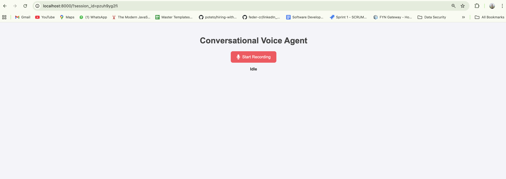

Conversational Voice Agent

Talk to an AI that listens to you and talks back, all in your browser. No transcripts, just a natural voice conversation.

What is this?

This is a little project that lets you have real spoken conversations with an AI. You click a button, start talking, and the bot listens and replies, in a real human-like voice.

   - You don’t need to read anything, all responses are played back as audio.

   - The experience is completely voice-driven.

   - Stop the conversation anytime you want.

How does it work?

Every time you speak:

   1. Your voice is recorded in your browser and sent to the backend.

   2. The backend transcribes your speech (using AssemblyAI).

   3. An AI (Google Gemini) thinks about what you’ve said and replies.

   4. That reply is converted into clear speech (using Murf AI).

   5. You hear the bot’s response in your browser.

   6. The conversation can keep going hands-free until you say “stop”.

What did I build?
   - A browser interface with a simple record/stop button and a clean look.

   - A backend that connects to AssemblyAI (speech-to-text), Gemini (AI chatbot), and Murf AI (text-to-speech).

   - Smart error handling, if anything fails, you hear a friendly fallback message.

   - Easy way to stop the agent so it doesn’t keep listening forever.

Can I try it or run it on my computer?

Yes! Here’s how:

   1. Clone the repo:

   git clone https://github.com/abhishekbavoria/voice-agent.git

   cd voice-agent
   
   2. Set up Python & environment:

   python -m venv venv

   source venv/bin/activate         # Mac/Linux

   venv\Scripts\activate            # Windows

   pip install -r requirements.txt

   3. Add a .env file to the project folder:

   (Get your free API keys from the service websites)

   MURF_API_KEY=your_murf_api_key

   ASSEMBLYAI_API_KEY=your_assemblyai_api_key

   GEMINI_API_KEY=your_gemini_api_key

   4. Start the server:

   uvicorn app:app --reload

   Then open your browser at http://localhost:8000

   5. Talk to your AI!

   Click "Start Recording", say something, and hear what the agent says back.

What do I need to run this?
   - Python 3.8+

   - API keys for AssemblyAI, Murf AI, and Gemini (see above)

   - A modern browser (Chrome, Edge, Firefox...)

Want to customize?
   - All the UI styles are in static/style.css

   - The browser logic is in static/script.js

   - The FastAPI backend is in app.py

   - You can swap out voices, change backend logic, or add your own features

Screenshots

That’s it!

I built this for fun (and learning), but it could be a base for much more, like a customer support bot or a hands-free productivity tool.

If you have questions or ideas, feel free to open an issue or message me!